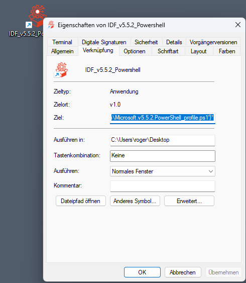
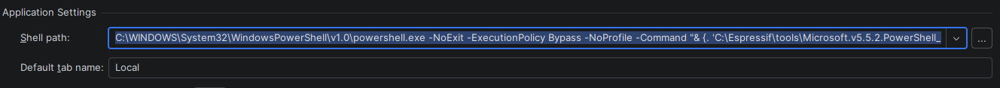

# Clion with the ESP-IDF

# Install ESP-IDF Installation Manager
`winget install Espressif.EIM`

#### Upgrade to new version
`winget upgrade Espressif.eim`

# Install with EIM
Install with eim a esp-idf environment use this env in Clion
to load with the terminal.

# Extend the Clion terminal
Get the link information 

Enter the parameters to terminal setting in
Clion so it run as esp-idf cmd.
