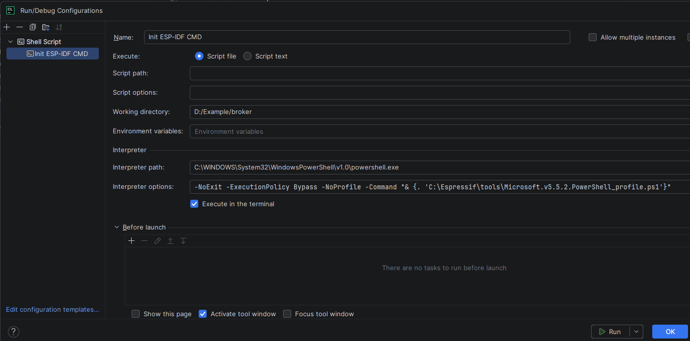
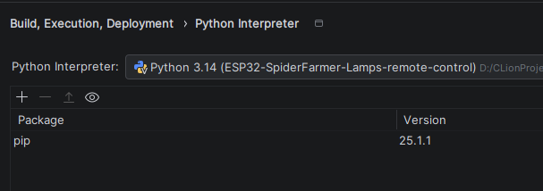

# Clion with the ESP-IDF

## 1. Install ESP-IDF Installation Manager
`winget install Espressif.EIM`

##### Upgrade to new version
`winget upgrade Espressif.eim`

## 2. Install with EIM
Install with eim a esp-idf environment use this env in Clion
to load with the terminal.

## 3. Extend the Clion terminal
After installing an ESP-IDF development environment.
Search for the information from the link properties.

Use these properties to add shell script 
cmd terminal to Clion.

In this example you can see the terminal start with 
IDF version 5.5.2 on this way you can start the terminal in Clion
with every version of IDF you have installed on the system.

## Add toolchain to Clion
Update this file and use it in Clion as 
toolchain from file
[espidf_source.bat](espidf_source.bat)

Important set this toolchain as default.

## Enter a python interpreter in Clion

